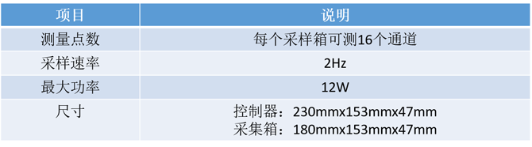
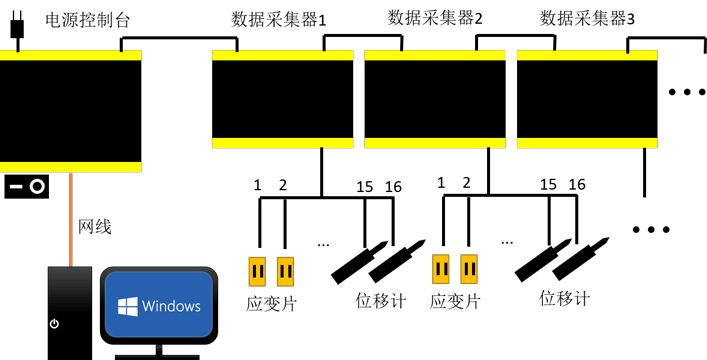
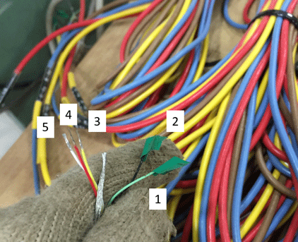
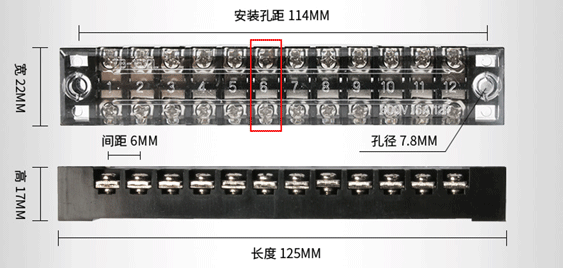
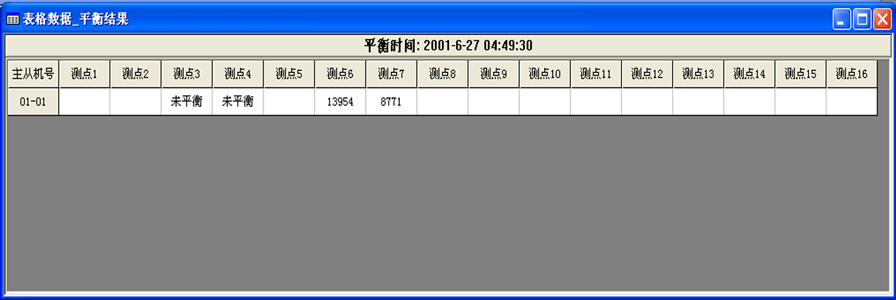

DH3821采集仪使用指南
===============================================

采集仪介绍
-------------

DH3821全名为DH3821静态应变测试分析系统，由电源控制台、数据采集器和若干接线组成。可以用来测量应变片的应变、位移计位移等。现教研室有电源控制台1台，数据采集器4台（通道共64个）其技术指标如下表：

   
采集仪的使用顺序为： 组装采集仪-连接测点-打开软件-打开采集仪电源-检测机箱-设置测点-设置存储信息-开始采样-停止采样-导出数据-关闭电源-拆分采集仪和测点-收纳采集仪
   
采集仪的组装
-------------

DH3821采集仪为黑色方盒饰以黄色边缘，电源控制台与数据采集器高宽相同，但电源控制台更大，且电源控制台上有网线插口和电源开关，二者易于分辨。

线总共有五种：网线（橙色）、电源线（黑色带三相插头）、通讯扩展线（两头均为PCI接口）、信号输入线（一头是PCI接口，一头是导线）和补偿信号线（棕色）。

.. note:: 线材均为插拔接口，且接口是对应的，只要选择的线头正确，均可轻松插上，因此如果碰到插接困难，应更换线种重试，切勿暴力连接，以免损坏接口。

采集仪的组装布置如下图所示：

采集仪的组装方法为：

- 插上电源线和网线。用一根通讯扩展线将控制台与数据采集器1号连接。（数据采集器上有标记机器号数，如1号机、2号机，请按照从小到大次序连接，此举虽非必要，但比较方便查看）
- 根据通道数量决定是否要接入更多数据采集器。如所需测点数量超过16个，再用一根通讯扩展线连接数据采集器1号和2号即可。如测点超过32个，再用一根通讯扩展线连接数据采集器2号和3号，以此类推。
 
.. note:: 实验室目前有4台数据采集器，因此最多支持使用64个测点，在设计实验时，请合理布置测点，以免测点不足。

- 用信号输入线接口端连接采集器，导线端与应变片/位移计相连。
 
- 接线完成检查无误，方可准备开机。

.. note:: 控制台和采集器的接线口均有防尘盖，使用前请取下并小心存放，使用完毕后再盖上，避免仪器受到污染。受到污染的仪器电阻可能发生变化，从而引发短路或测数不准。

信号输入线
-------------

每一台数据采集器有四个 ``信号输入线`` 接口，每一根信号输入线有四根 ``分支线`` ，分别为棕色、红色、黄色和蓝色。每一根分支线即为一个通道，可以获取一枚应变片或一个位移计的数据，因此一根信号输入线可以测4个测点，一台数据采集器可测16个测点。每一根 ``分支线`` 有5股，每一股为Eg+（红色）、Vi+（黄色）、Eg-（黑色）、Vi-（绿色）和1/4桥（白色）。

连接测点
-------------

实验室采用的做法是，将应变片/位移计通过导线连接在 ``接线盘`` 一端，数据采集器接出的线（即信号输入线）的导线端接在 ``接线盘`` 的另一端。二者通过接线盘实现连接，从而免去了将导线焊接在一起的步骤过程，易于更换和检查问题，且可以接更长的距离（信号输入线是标准的5m线）。另一个原因则是，如果采用焊接连接，每次使用后会造成线的损耗，而信号输入线没有可替换的产品，会影响采集仪的后续使用。

接线盘由8个接线端子固定在木板上组成。每个接线端子有12个节，每节是连通的，节与节之间却是绝缘的，把金属线头放进接线端子，并用螺丝刀旋紧，即可实现连接，接线端子样式如下：

- 1.应变片的连接

 应变片连接前请参照 :doc:`straingauge` 熟悉应变片的贴片操作。
 
 当应变片贴好且焊接完成导线之后，应变片接出的导线，一股与分支线Eg+（红色）连接，一股与分支线的Vi+（黄色）和1/4桥（白色）相连。两股的连接顺序没有规定，连接方式示意图和实际连接图如下：
 
 .. image:: strainconnection.png
   :align: center
   
 .. image:: straintocable.png
   :align: center

 这种接法称为 ``外补偿法`` ，需要设置外补偿片。 
   
- 2.通道补偿线的连接

 通道补偿线是棕色的六股线，专门用于对外补偿法的应变片进行温度等外补偿，倘若使用 ``外补偿法`` 则必须使用外补偿。通道补偿线的六股线分为两组，一组是1-8通道Eg+（红色）、1-8通道V-（棕色）、1-8通道1/4桥（绿色）；另一组是9-16通道Eg+（黄色）、9-16通道V-（黑色）、9-16通道1/4桥（蓝色）。每一组连接一应变片，接法与上文提到的方法相同。第一组对1-8通道的应变片进行温度补偿，第二组对9-16通道的应变片进行温度补偿。
 
 .. note:: 作为温度补偿的应变片应当放置在不受力，却与要补偿的应变片温度环境相近的条件下。由于补偿通道一次性补偿8个通道，实验设计时，应尽量将温度条件相近的测点放在共同补偿的通道上，以便统一补偿。如8个通道的温度环境不同，则统一补偿不适用，需要对每个应变片设置补偿片（下文会介绍此操作）。
   
- 3.位移计的连接

 实验室采用的是溧阳仪表厂生产的位移计，位移计有三股线，分别为A（红色）、B（黑）、C（蓝），与信号输入线一根分支线连接。对应关系为：A（红色）接分支线Eg+（红色）、B（黑色）接分支线Vi+（黄色）、C（蓝色）接分支线Eg-（黑色），如下图所示：

 .. image:: LVDTconnection.png
   :align: center
   
 .. image:: LVDTtocable.png
   :align: center
   
 位移计通常与磁性表座一起配合使用，实现其固定，如下图：

 .. image:: LVDTandmagnet.png
   :align: center

 通过表座，位移计可以用来测量任意方向的位移变化。
 
 .. note:: 机械式位移计比较容易损坏，因此使用时，不要让其在偏离平衡位置很大的情况下突然弹回。有时在实验加载速率比较缓慢时，位移计容易卡壳，此时可以在表座或位移计头部固定部分绑一皮筋，另一头连在位移计活动的针尾，相当于施加了一个预压力。
   
软件使用说明
-------------

.. note:: 实验室的说明书档案里有一本《DH3821静态应变测试分析系统软件说明书》，对此软件的使用方法和其拓展的分析方法做了详细介绍。可以在实验室查看，或 :download:`点此下载 <DH3821静态应变测试分析系统.doc>`

- 1.打开软件并开机

 之前步骤完成后，即可打开网线所连接的电脑（实验室默认为邦威试验机前方黑色台式机，也可使用实验室的BenQ笔记本电脑），电脑桌面上有一名为 `DH3821静态应变测试系统` 的软件，进入界面如下：
 
 .. image:: DH3821software.png
   :align: center
 
 
 
 接下来打开电源控制台的开关（黑色方形的双极开关），正常会有电源绿灯亮起，并伴有“咔哒”声。桌面右下角弹出 **本地连接已连接** 提示，同时软件右下角检测到一个IP地址（这是安装软件时预设的，不会改变，也不需要更改）
 
 第一行菜单栏依次为： ``文件`` ``设置`` ``控制`` ``观测`` ``处理`` ``查看`` ``窗口`` 和 ``帮助`` 。
 
 * ``文件`` 用于新建、打开、存储文件。
 
 * ``设置`` 用于设置应变花、测点的显示和计算、图形表格属性等。
 
 * ``控制`` 控制采样、机箱检测和通道自检等。
 
 * ``观测`` 查看数据、放大缩小数据测点等。
 
 * ``处理`` 数据修正处理等。
 
 * ``查看`` 设置工具栏等的隐藏与显示。
 
 * ``窗口`` 新建窗口和查看历史窗口。
 
 * ``帮助`` 获取软件版本号和查看帮助文档。
 
 正常情况下，一般只使用 ``文件`` 和 ``控制`` 下的内容。其他菜单栏项目在说明书上有清晰介绍，也易于查找，此处不进行赘述。

- 2.检测机箱和新建项目
 
 点击 ``控制`` 选择 ``检测机箱`` ，软件会自动识别所连采集器的数量和编号。如：若只连1号采集器，会提示“找到如下机箱： 01-01”。倘若检测机箱数量与检测结果不符，请检查连线是否有问题。
 点击 ``文件`` - ``新建`` ，新建一个项目到指定位置。
 
 .. image:: findthemachine.png
   :align: center
   
   
 
 .. note:: 每次自检和平衡（下文会说到此操作）均会清除之前的内容，倘若需要保存原平衡结果，需要在再次平衡和自检前，新建另一项目。

- 3.更改通道参数栏

 根据检测的采集器数量，在底部的通道参数栏，会显示对应的测点号，数量与采集器有关，是16的倍数。即，不论此测点是否连接应变片或位移计，它都会显示在通道参数栏中，你可以双击通道参数栏中的 ``测点显示`` 将 ``√`` 变为 ``×`` ，在平衡和采样过程中，就不会再显示。
 
 单击 ``测量内容`` 选项，可以选择想要测试的项目，如应变应力和桥式传感器。这里的选择要根据实验的测点布置来设置，将应变片对应测点设置为应力应变，将位移计测点设置为桥式传感器。
 
 
 .. tip:: 与Excel操作一样，可以按住键盘 ``shift`` 键，进行多选，更改一个则选中项会统一更改，提高效率。建议如果应变片更多，可以将所有测点都先改成应力应变，再将为数不多的位移计测点修改为桥式传感器，效率更高。

 此项设置完成后，就可以在底部的 ``应力应变`` 和 ``桥式传感器`` 栏设置通道的参数。
 
 ``应力应变栏`` 中，显示类型为应变，方式为带外补偿的方式1（120R），灵敏度系数查找应变片包装。导线电阻，可以默认为0，也可以填写0.8Ω，如果所有测点的导线的长度和粗细都相差不大，此项影响不大，因此在连接时，选取长度、粗细相同的导线为宜。
 
 .. image:: yingbianpianlingminduxishu.png
   :align: center
 
 最后的 ``补偿通道`` 选项，如若使用统一的外补偿（即棕色接线进行补偿），则填默认”无“；如有应变片需要单独补偿的，需要事先在不受力的地方粘贴一个应变片，此应变片与其他应变片一样需要占用一个通道，在 ``补偿通道`` 中选择其所占用的通道，则此应变片将作为补偿片使用。
 
 从中可知，如果统一补偿，则可使用专用的补偿通道而不需要额外占用通道。因此合理安排应变片的布置，就可以获得更多的测点数据。一般只在不可避免的情况下，占用通道进行单独补偿。
 
 .. image:: channelsetting.png
   :align: center
   
 桥式传感器栏中，只需要填写对应量程应变片的灵敏度系数，并将桥路类型改为 ``半桥`` ，量程范围会自动变化，工程单位选择为 ``mm`` 即可。关于灵敏度系数的取值见下表:
 
 .. image:: channelsetting2.png
  :align: center
   
 .. image:: LVDTparameter.png
  :align: center
  
 .. note:: 从表中可知，50mm量程和100mm量程的灵敏度洗漱一致，因此这两种在通道参数栏的量程中均显示为100，而不会显示50，不影响测量。
   
- 4.通道自检

 如果使用了应变片，可以通过通道自检来检测应变片是否正常连接。点击 ``控制`` - ``通道自检`` ，在弹出窗口中点击“是”，即可开始通道自检。
 
 .. image:: channelcheck.png
   :align: center
 
 通道自检会显示两种情况： ``开路`` 和数值。
 
 当显示 ``开路`` 时，有以下两种原因：
 
 * 应变片或者导线有断开，此时应用电表在接线盘上检查对应测点的阻值（检查阻值时要关闭采集箱，因为采集箱开机通电后，回路中有电流，无法用万用表测出电阻）。若电阻为120Ω，说明应变片为通路（因为应变片阻值是120Ω），采集器线路可能有断开，重新拧紧再试。若为150Ω，则说明采集器是通路（采集器内阻是150Ω），应变片发生了开路，检查应变片的焊接状况。正常情况下，万用表测得阻值应该在120Ω以下，这与接入的应变片通道数有关，因为万用表在接线盘上测量到的是应变片和采集器内阻并联的阻值，如下图所示。
 
 .. image:: parallel.png
   :align: center
 
 
 检查电阻只需要把万用表两表笔分别放在端子的两个金属片上即可，由于金属片是连通的，放在靠近导线或者数据输入线一侧均可。检查完毕后，请务必盖好防尘盖。以免落灰和导线相碰短路（不用的导线已经用绝缘胶布包裹）
 
 .. image:: checkforstrain.png
   :align: center
 
 * 若以上均满足要求，仍显示开路，则更换应变片。这种情况的原因可能是应变片损坏，阻值仍不变但是无法反馈电信号的变化。以上操作不行可更换通道再试。
 
 当显示数值时，有以下几种情况：
 
 * 数值为600左右，则测点正常。
 * 若偏离600超过20，则平衡测点后启动采样，看看是否有数据点不平衡或跳动较大，更换此测点贴片后再试。（一般发生此类情况时，偏离600的数均为8个，且8个数值相互接近，这是因为每个通道只占用了1/4桥的一部分，8个通道是相互关联的。只要找到问题通道，其他即可恢复正常，不必特别恐慌。）
 
 * 若数值极小，则可能发生短路，关闭电源后，用万用表检查测点，再检查是否有线发生交叉短路。
 
 .. tip:: 为避免短路，不用的线头建议使用绝缘胶带一层进行包裹，抽取方便，当使用时，只需要将胶带抽掉即可。当通道自检正常后，即可开始平衡测点了。
 
- 5.平衡测点

 平衡测点，即对应变片的值进行归零操作。操作方法为： 点击 ``控制`` - ``平衡测点`` - ``确定`` 。等待数秒后，会显示平衡结果。正常情况下平衡结果为一数值（一般不会超过2000），当测点出现问题时，会出现 **未平衡** 提示或者数值很大，见下图，此时则需要排查接线等问题。
 

   
- 6.启动采样

 当平衡测点结果均在正常值时，即可以尝试开始采样。 操作方法为：点击 ``控制`` - ``启动采样`` 。如果之前忘记新建文件夹，在这里会提示你建立文件夹，之后才开始采样。采样开始后，可不施加荷载观察几分钟，对于应变片，数据为整数，若数值均在0左右（波动不超过10），则该测点完好。如果是位移计，数据为3位小数，数值均在0.000左右（波动不超过0.010或0.020，与量程有关），则位移计正常。如果测点跳跃较大，则需要停止采样后，检查该测点，再重新采样（应变片检查焊接情况，导线是否受到拉扯，引线是否接触到金属表面；位移计可以更换一个再试）。达到以上标准后，可以开始正式采样并施加荷载。

- 7.停止采样和数据导出

 当试验结束采样完成时，即可停止采样。操作方法为：点击 ``控制`` - ``结束采样`` 。采样停止后，可以点击 ``文件`` - ``另存为`` ，可以看到采集仪提供了多种输出格式，文本、位图、Excel和Matlab文件，一般情况下我们选择另存为Excel文件。点击 ``另存为Excel文件`` 后，会弹出下图窗口。

 .. image:: saveExcel.png
   :align: center

 如果使用采集器数量多于1个，记得点选 ``所有测点`` ，否则只会显示一个采集器的测点。 ``>>`` 会选中左侧框中所有测点进行输出，``>`` 则只选择鼠标点选的测点。下面的 ``选项`` 中内容可全部勾选，``确认`` ，选择保存路径和文件名即可。

 .. Tip:: 当位移计和应变片同时存在时，二者的小数位数不同，导出时只能统一导出一种数据格式。因此位移计数据和应变片数据应分开导出。在导出相应项目前，点击菜单栏 ``设置`` - ``表格属性`` ，在小数位设置中，选择对应要导出的项目，填写对应的位数，再按以上步骤导出即可。

 .. image:: decimal.png
   :align: center   
 

注意事项
-------------
 
- 当有使用本说明未提及功能时，请一定仔细查看说明书说明或咨询厂家，避免造成数据错误，影响日后数据分析。
- 采集仪应当放在平面上，避免振动。不使用时盖好防尘盖并进行覆盖，防止落灰积灰。
- 关于仪器技术问题和维护，可以拨打电话 ``13788934849（朱工程师）`` 或 ``021-50271788`` 寻求帮助。
   
   
 
 
 
 

