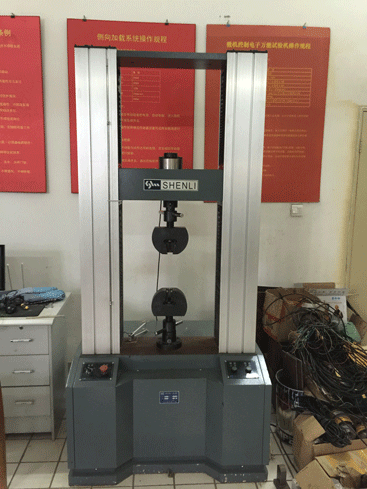
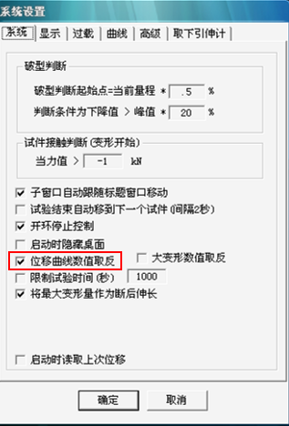
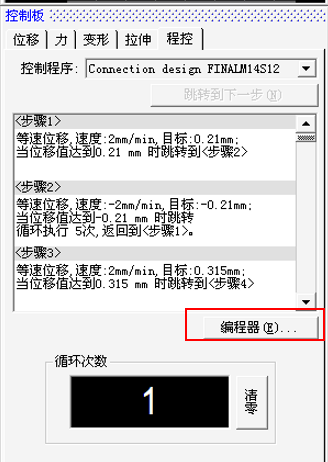
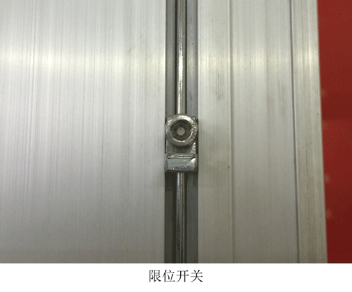

申力试验机使用指南
===============================================

试验机介绍
-------------

申力试验机全名WDW-50kN微机控制电子万能试验机，由主机、电控箱（位于主机底部）、计算机三部分组成。

试验机使用说明
---------------

试验机的使用顺序为：启动电脑-启动控制软件-启动试验主机-在软件中输入试件信息-固定试件-开始试验-试验结束手工取下试件-保存数据-关闭试验主机-关闭电脑控制软件-用U盘拷贝试验数据-关闭电脑

- 1.启动电脑和控制软件

 试验机由其左侧的电脑控制，电脑主机同普通电脑，可直接开机。桌面上有 `MaxTest.exe` 主程序，打开即可进入控制软件。

- 2.启动试验机主机

 试验机主机的开关在试验机的侧面：
 

 .. image:: shenlipower.png
   :align: center
   
   
 启动顺序为：打开软件-转动正面开关旋钮到开-按下侧面黑色开关（此时红色开关会弹起）
 
 关闭顺序为：按下侧面红色开关（此时黑色开关会弹起）-转动正面开关旋钮到关-关闭软件

 .. note:: 侧面黑色按钮有些许不灵敏，要诀就是按下时，需要果断迅速且用力按下，才能实现黑色按钮按下红色弹起。如遇到按下黑色按钮后却又弹起，不用慌张，如果红色按钮已经弹起，只需按下红色按钮之后用力再次尝试即可。尽量还是保持一次成功，否则对机器有一定损害。
 
- 3.单向加载试验软件操作

  软件操作界面如下图：
  
 .. image:: softwareshenli.png
   :align: center
  
 可以看到软件第一行为主窗口，这一栏依次为 ``系统`` ``数据`` ``设置`` ``调整`` ``工具`` ``窗口`` ``帮助`` ，右侧的快捷按键可以启动一些主窗口中常用的设置。

 - ``系统`` :控制程序退出。
 - ``数据`` 用于设定数据的输出格式，记录频率等，一般也可不设定。
 - ``设置`` 此项下包含 ``选择力传感器`` ``选择引伸计`` ``系统设置`` ``分析设置``  。此项是最常用的一项，经常需要调整。后文会介绍。
 - ``调整`` 进行力传感器和引伸计的调整，只有维护人员会使用。
 - ``工具`` ``窗口`` ``帮助`` 默认选项即可，一般很少修改。
  
 软件第二行是力和变型显示板，用于显示荷载和位移。试验前须点击右上角的 `0.0` 进行清零操作。
 单向加载时，点击 ``破型判断`` ，当此按钮呈现黄色（凹陷状）时，可以根据试验的拉压情况进行选择，当面板显示为 `拉伸` 时，会显示拉力（正），当拉力达到试样破型的条件（如承载力下降到峰值的80%）会自动停止实验；同理，当面板显示为 ``压缩`` 时，会显示压力（负），达到试验停止条件后会停止。破型判断的条件可以在 ``系统设置`` 菜单中设置，默认设置是在承载力下降到峰值的80%后停止。当 ``破型判断`` 按钮弹起时，试验不会自动停止，必须手动停止。试验中，若已经达到自己设定的实验目标，也可以手动停止。
 
 .. note:: 未使用引伸计时，需将 ``取下引伸计`` 按钮按下（呈黄色），否则无法进行位移测量。关于引伸计的使用，见下文。
 
 第三行左侧是曲线板，用于试验开始后的变形显示，可以根据自己的需求选择力-时间、力-变形等。均为可视化一键点选，不做赘述。程序会在加载过程中，自动确定一些特殊点，用户可以在此图形界面中，通过曲线板右上角的快捷小工具进行数值的查看和放大、缩小等操作。关于这些特殊点，可以在软件第一行点击右上角的 ``分析板`` 进行查看和设定。
 第三行中间列是数据板，从左至右分别是： ``新建`` ``打开`` ``保存`` ``导出另存为(Excel,文本)`` 和 ``打印`` 。 在实验开始前，应当新建试件，设置好试件名称、保存位置等信息。在实验结束后，可用打印曲线、导出另存为文本和Excel等。下面的 ``详细`` 可以查看和填写试件的详细信息，也可以不填； ``列表`` 可以从中调取历史记录，快速查看历史曲线和历史数据，在之前忘了保存数据的话，可以有一个补救机会，来查看之前的数据和导出。
 
 .. image:: databoard.png
    :align: center
 
 
 第三行右侧是控制板，控制方式选项卡上有 ``位移`` ``力`` ``变形`` ``拉伸`` ``程控`` 选项。分别代表位移控制、力控制、变形（应变）控制、典型拉伸实验和编程确定的加载方式。一般来说，常用的是 ``位移控制`` ，荷载控制模块并不准确，一般很少使用。下面的 ``闭环控制`` 则默认勾选。 ``位移保持`` 功能距经验并不好用，一般也不采用。
 
 万能试验机只能上下运动，由于试件高度不同，试验前一般需要上下调整加载梁的高度以放入试件。为了区别上下运动是在调整高度还是加载，引入了一个 ``调整位置`` 按钮。当按下时，呈现绿色，表明正在调整位置， ``开始`` 按钮会变成 ``上升`` 和 ``下降`` 此时不会记录数据。当 ``调整位置`` 按钮弹起，呈现灰色，表明正在加载，记录实验数据。
 选择速率之后，点击开始横梁即开始运动。当试验完成之后（手动停止需要点击 ``停止`` 按钮，达到破型判断条件自动停止则不需要进行其他操作），可以点击复位，试验机将自动回到试验前归零的位置。
 
 .. image:: transfor.png
   :align: center
   
   
 .. note:: 调整位置时，选项中最高速度为200m/min，但最快速度最好不要超过100mm。 位移控制加载最高速度为50mm/min。
 
 
 当进行当向压缩操作时，如果想看到实时曲线，需要在 ``设置`` - ``系统设置`` 中点击 ``位移曲线数值取反`` 。保存数据仍然会正常记录，如果不关心实时曲线情况，也可以不予理会，在导出数据后，用Excel进行绘图。
 

   
 
- 4.往复加载试验软件操作

 要实现往复加载，需要使用控制板上的 ``程控`` 功能，点击 ``编程器`` ，输入密码85359710，进入编程器（此密码只是为了防止误触而设定）。接下来按提示输入设计好的加载速率、目标值和循环次数即可，简单易学，此处不再赘述。
 

   
- 5.引伸计的使用

 引伸计是测量构件及其他物体两点之间线变形的一种仪器，如钢材拉伸实验中，需要测量标距间的变形，就需要使用引伸计。
 
 .. image:: yinshenji.png
   :align: center
 
 引伸计的使用步骤如下：
 
 * 将引伸计轻轻拿起，把标距杆垫片卡在力臂和标距杆之间，压紧两力臂，使两刀刃垂直接触试样。
 * 用弹簧或橡皮筋将引伸计绑在试样上，装好后取出标距杆垫片，使力臂与标距杆之间保持大约0.5mm的间距。
 * 在试验机控制软件界面，将 ``取下引伸计`` 按钮弹起。
 * 引伸计信号显示调零。
 * 进行试验测量变形的大小。
 * 当变形达到试验方案设置的引伸计切换点时，即当材料达到屈服极限时，应该迅速取下引伸计。否则试件崩断时可能打坏引伸计。
 
 .. image:: yinshenji2.png
   :align: center
   
- 6.进行试验

  进行试验前要做好各项准备工作，阅读之前设计试验的内容。这里以几个试验为例作为参考。万能试验机可以胜任拉压剪等各种实验情况。
  
 .. image:: experimentsofshenli.png
   :align: center
 
注意事项
-------------

* 由于涉及到用电操作，且加载头较重，使用时注意防止砸脚，安装加载头时请确保有两人在场。
* 试验完成后，需将加载头归位，配套的工具放回右侧的1号橱中，以便下次取用。
* 设备暂停使用时应将油泵电机关闭，离开设备前应给系统断电。   
* 试验前应对试验力和试件竖向高度的最大值有所估计，避免超过量程。
* 机器开关右侧有一个急停开关，用于在紧急情况下停止作动器，其他情况应正常开关。
* 试验机上下均有限位开关，放置机器上升过多顶坏横梁或者下降过多，压坏底座。试验前，应当检查限位位置是否处于合适高度。       
* 机器出现任何问题，或对软件有疑问，请拨打电话：``13371905678（张工程师）`` 或者客服电话 ``4008205976`` 联系申力厂家寻求技术支持，并在试验室的维护登记表上做记录。
  

 
 
 
 

 

