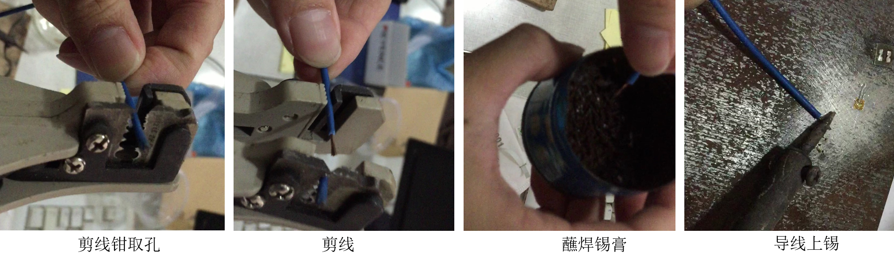

应变片的粘贴
===============================================

应变片简介
------------------

应变片的规格多种多样，常见的应变片属于 **电阻式应变片** ，是将被测的非电量转换成电阻值的变化，通过测量电阻值变化达到测量非电量的目的。电阻式应变片目前应用最多的是 **箔式应变片** 。

箔式应变片是在较薄的树脂材料的电绝缘体上，将金属箔蚀刻制成栅格形状，然后再安装引出导线的结构，如下图所示。

 .. image:: strain.jpg
    :align: center

将单轴应变片按一定的形式可组合成不同样式的应变花。常见的应变片或应变花有以下种类：

 .. image:: strain2.jpg
    :align: center
	 
应变片选购
----------------

应变片的命名规则如图：

 .. image:: namingstrain.jpg
    :align: center 

以BX120-0.5AA为例，即箔式缩醛类应变片，阻值为120Ω，应变片栅长0.5mm。

关于应变片的选择，与测试环境等因素有关，BX型120Ω应变片适用于静态应变情况，对绝大多数土木工程领域实验均可胜任，也是教研室常选用的型号，关于其他型号，可参考网络上的关于 `应变片选型的解释`_ 。

.. _应变片选型的解释: http://wenku.baidu.com/link?url=CZ85yX6E0J-msC1DEozJEuh0S6DqxO4nOJZU1NpyoCr1FKSNWgZKblEstYjW21xf39jObuse9i9nIwfc-jl4LgPwC9gyjZYuUn9eB8v8CA7

余下的最主要的是对应变片栅长的选择，用于混凝土应变测试的应变片要求敏感栅长度较长，箔式片的敏感栅长度宜用10、20、30mm；木材、玻璃的应变测量宜选用栅长为5mm的应变片。一般钢的应变测量宜选用栅长为1-6mm的应变片。应力集中测试宜用栅长为0.15-2mm的单或双轴5片型应变片。此外在应力梯度大的地方，宜选用小的栅长，因为应变片测得的是栅长范围内的平均应变。

单枚应变片一般用于测量单轴应变，应变花用于测量平面应力状态。材料泊松比的测量宜选用正交的双轴应变花。应力分析宜选用0/90/45度的三轴应变花。二轴90度应变花用于主应力方向已知的场合，三轴和四轴应变花则用于主应力方向未知的场合。

应变片粘贴步骤
----------------

下面以钢结构应变片粘贴为例说明应变片的粘贴方法

- 1.贴片前的工具准备

 由于需要使用502强力胶水进行贴片，502胶凝结速度快，在此过程中，来不及寻找工具。所以粘贴应变片前一定要确保工具都在手边。需要准备的工具有：应变片、端子、镊子、脱脂棉、酒精、塑料薄膜、砂纸、电烙铁、焊锡和焊锡膏。

 .. figure:: preparematerials.png
   :scale: 40 %
   :alt: 贴片材料
   :align: center

- 2.选择并清洁表面

 选择需要测量的部位后，就要对该部位进行清洁，清洁表面的目的是为了应变片能够测量到钢的应变，而不是表面的杂质的应变，如铁锈、灰尘的应变。因此如果锈蚀严重或表面有油漆，可用 **角向磨光机** 进行打磨，再用细砂纸；如果锈较少，可用粗砂纸先打磨一遍，再用细砂纸打磨。

 .. image:: crushingcompare.png
    :align: center 

 .. note:: 角向磨光机 是一种危险性较高的实验机具，大多数情况下，并不需要使用，出于安全考虑也不建议使用。当需要使用时，请参考  `角向磨光机使用注意事项`_
 
 .. _角向磨光机使用注意事项: http://blog.sina.com.cn/s/blog_69396cb40100rnyf.html

 在贴片位置用细砂皮打磨成与受力方向成45°的交叉纹，这是为了增加材料与应变片之间的摩擦，避免粘贴应变片时出现打滑的现象，并可在粘贴位置用铅笔或锥子做标记如图。

 .. image:: crushing.png
   :scale: 50 %
   :alt: 准备工作
   :align: center

 
 最后用脱脂棉球蘸少量酒精擦拭表面。酒精挥发速度快，不久即可开始粘贴应变片。
   
 
 .. note:: 此处脱脂棉不可用纸巾代替，因为纸巾可能会留下纸屑影响实验结果。

 
- 3.粘贴应变片
 
 从包装中取出应变片，应变片有两面，如下图所示。应变片引出线弯成45°方向，手捏住应变片引出线、粘贴面朝上，滴上少量502胶水，把多余胶水甩掉。甩的过程也有助于胶水均匀分布到表面。一手拿应变片对准画线位置后，另一手拿塑料薄膜快速固定应变片，用大拇指从引线端向尾端轻轻挤压三遍后，用力按住应变片1分钟，确保胶水干透。塑料薄膜的目的是防止拇指被胶水粘住。然后从引线侧轻轻揭开塑料薄膜。观察应变片颜色是否均匀，如果不均匀说明含有灰尘或者胶水分布不均，需要重新粘贴。

 .. image::  pastestrain.png
    :scale: 50%
    :align: center
	
 以上步骤可由下图演示：

 .. image::  tiepian.png
    :scale: 50%
    :align: center
 
 
- 4.粘贴端子

 由于引线较细，必须要通过导线才能实现应变片与采集箱的连接。引线与导线需要通过 **接线端子** 连接起来。接线端子一般为10个一排，一个应变片需要两个端子，端子在使用之前需要上锡，上锡时用镊子固定住一端，用预热的烙铁蘸取锡进行涂抹。由于端子的表面金属具有亲锡性，很容易就可将锡吸附在端子上，完成后，用剪刀将端子2个一组剪下即可。

 粘贴端子时，首先在引线一侧偏移一定位置，用502胶水将端子粘牢，粘贴方法与应变片相同。（端子粘贴面并不需要做清洁处理，但是也需要除去表面锈迹，保证端子能牢固粘贴在钢表面上）

 .. image::  duanzi.png
    :scale: 45%
    :align: center

- 5.焊接引线

 待端子粘贴牢固后，需要将引线焊接到端子上。具体操作为:一手用镊子夹住引线，将其按在端子上，一手用发热电烙铁侧面轻轻在端子的锡上一摁再抬起。因为烙铁可以使端子上的锡软化，抬起后锡迅速凝固，将端子与引线牢固焊接在一起。注意端子上引线必须全部溶入焊锡中，焊后引线要带有一定的弧线，不能成绷紧状态，一般只要端子靠近应变片，且镊子夹取引线时不要用力拉扯就没有问题。引线紧绷可能会影响受力的大小，导致测数不准。焊接引线过程见下图动态演示（若不能播放，请右键“在新标签页中打开图片”）

 .. figure:: welding4.gif
   :scale: 70%
   :alt: welding
   :align: center

- 6.应变片检查
 
 将电表调到电阻200Ω档，将表笔两头分别放置在端子两极，观察读数。由于采用的是BX120系列，阻值应该在120Ω附近。如下图。

 .. figure:: examination.jpg
   :scale: 30%
   :alt: examination
   :align: center

- 7.为导线上锡

 导线一般由多根铜丝构成，因此容易散开。散开的铜线极易同时碰触到两根应变片引线及钢表面造成短路或者电阻异常，因此需要为导线上锡，使之拧成一股，方便焊接。
  

 .. figure:: string.jpg
   :scale: 50%
   :alt: string
   :align: center
   

 
 为导线上锡前，在剪线钳上找到导线直径对应的孔位，用剪线钳剪出线头，用手将导线拧成一股，蘸些许焊锡膏（焊锡膏是一种亲锡材料，导线本身不容易吸附烙铁上的锡，因此涂上焊锡膏能够使得导线吸收更多的锡），用手抹匀。用预热的烙铁蘸取锡，并用烙铁上带有锡的一面刷导线，可以刷导线的不同面，直到导线被焊锡凝成一股。

 
   
- 8.焊接导线

 与第4步方法相同，将导线焊接于端子上。通过粘结二者的金属锡，应变片的引线与导线形成通路。如下图。

 .. figure:: connection.png
    :scale: 45 %
    :alt: examination
    :align: center

 
 .. note:: 这里为了便于拍摄，在照片中端子和应变片间距较大，实际操作中应尽量将端子贴在与应变片接近的地方。如果端子与应变片间距较大，为了防止引线与打磨的钢表面连通，应当在空隙上贴上绝缘胶布，如下图。

.. image:: Adhesivetape.jpg
	:align: center
	:scale: 25%
	
	
- 9.将导线连接到采集仪

 最后将导线的另一头接到接线板和采集仪，这一步我们将在下一章进行说明，打开采集仪即可开始采集应变。

 

